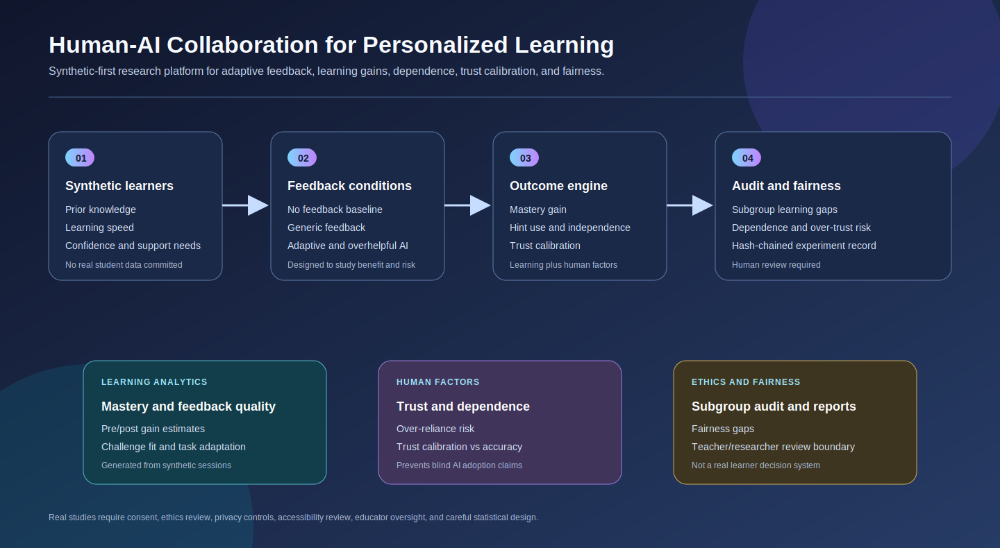
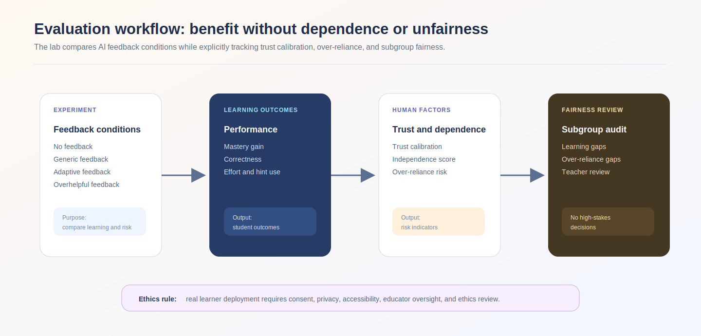
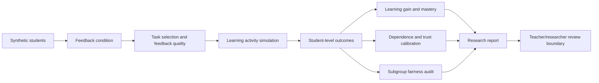

# Human-AI Personalized Learning Lab

<p align="center"><strong>Synthetic-first research platform for evaluating whether adaptive AI feedback improves learning while minimizing over-dependence, unfairness, and miscalibrated trust.</strong></p>

<p align="center">
  <a href="../../actions/workflows/python-checks.yml"></a>
  <a href="LICENSE"></a>
  
  
</p>

> **Ethics boundary:** this independent academic prototype uses fictional learners and tasks by default. It does not grade real students, make placement decisions, or prescribe real interventions. Real studies require consent, privacy review, accessibility review, educator oversight, and ethics/IRB-style review where applicable.

---

## Research objective

Can an adaptive AI learning assistant improve student mastery and feedback quality while avoiding over-dependence, unfair treatment across learner groups, and miscalibrated trust?

| Research question | Evidence generated by local run |
| --- | --- |
| Does adaptive feedback improve mastery compared with no/generic feedback? | Feedback-mode learning gain table and mastery curves |
| Does too much help create dependence? | Dependence, hint-rate, independence, and over-reliance metrics |
| Is learner trust calibrated to performance? | Trust-vs-accuracy gap and trust/dependence figure |
| Are outcomes unfair across synthetic groups? | Subgroup fairness audit and gap summary |
| Can recommendations remain human-controlled? | Next-activity recommendations with review boundary |
| Can experiments be reproduced and audited? | CSV outputs, figures, report, and hash-chained audit log |

---

## Architecture

<p align="center"></p>

The diagram is conceptual documentation. It is not an empirical result, classroom system, or product claim.

| Layer | Function | Output |
| --- | --- | --- |
| Synthetic learners | Prior knowledge, learning speed, confidence, engagement, support need | Fictional student table |
| Learning tasks | Math, programming, reading, and science concepts | Task difficulty table |
| Feedback conditions | No feedback, generic, adaptive, overhelpful | Experimental comparison groups |
| Outcome engine | Mastery, correctness, effort, hint use, trust, dependence | Session-level activity table |
| Evaluation | Learning gain, independence, trust calibration, fairness gaps | Metrics and report |
| Recommendation layer | Next activity / intervention suggestion | Human-review recommendation table |
| Audit layer | Seed, config, metric summary, hash chain | Tamper-evident local log |

---

## Run today — no real student data needed

```bash
python scripts/run_synthetic_learning_lab.py
```

Windows quick start:

```bat
cd %USERPROFILE%\human-ai-personalized-learning-lab
git pull

py -m venv .venv
.venv\Scripts\activate

python -m pip install --upgrade pip
python -m pip install -r requirements.txt
python scripts/run_synthetic_learning_lab.py
```

Optional controls:

```bash
python scripts/run_synthetic_learning_lab.py --students 360 --sessions 10 --seed 42
```

---

## Generated local outputs

```text
outputs/results/synthetic_students.csv
outputs/results/synthetic_tasks.csv
outputs/results/synthetic_learning_activity.csv
outputs/results/synthetic_student_outcomes.csv
outputs/results/synthetic_feedback_mode_summary.csv
outputs/results/synthetic_fairness_audit.csv
outputs/results/synthetic_dependence_trust_summary.csv
outputs/results/synthetic_next_activity_recommendations.csv
outputs/results/synthetic_learning_summary.json
outputs/reports/synthetic_learning_report.md
outputs/audit/learning_audit_log.jsonl

outputs/figures/synthetic_learning_gains.png
outputs/figures/synthetic_trust_dependence.png
outputs/figures/synthetic_fairness_gaps.png
outputs/figures/synthetic_mastery_curves.png
outputs/figures/synthetic_recommendation_mix.png
```

All outputs are synthetic and generated locally. No real student records are included.

---

## Evaluation workflow

<p align="center"></p>



---

## Feedback conditions

| Condition | Intended research role | Risk being studied |
| --- | --- | --- |
| `none` | Baseline independent practice | Lower support may limit learning for some learners |
| `generic` | Non-personalized feedback | Feedback may be too broad or poorly timed |
| `adaptive` | Personalized feedback and challenge fit | Must improve learning without unfairness |
| `overhelpful` | Risk condition with high hint support | May increase dependence and over-trust |

The “overhelpful” condition is included because a useful AI education study should test both benefit and harm.

---

## Metrics

| Metric | Meaning | Boundary |
| --- | --- | --- |
| Learning gain | Post-session mastery minus early mastery | Synthetic proxy only |
| Final mastery | End-of-run mastery estimate | Not a real assessment score |
| Hint rate | Amount of AI assistance used | Dependence proxy |
| Independence score | `1 - dependence` | Heuristic indicator |
| Over-reliance risk | High dependence plus high hint usage | Threshold-based proxy |
| Trust miscalibration | Difference between trust and observed accuracy | Simplified trust calibration proxy |
| Fairness gap | Max subgroup difference in gains, success, reliance, or trust | Requires caution even in real studies |
| Adaptation quality | Challenge fit plus feedback quality | Simulated personalization quality |

---

## Human-review recommendation engine

The lab produces reviewable next-step suggestions, such as:

- reduce hint availability and add independent practice;
- provide scaffolded practice with formative checks;
- add a reflection prompt to recalibrate trust;
- increase challenge and request explanation before feedback;
- continue adaptive practice with evidence-based feedback.

Every row includes the boundary:

```text
recommendation only; teacher/researcher review required before use with real learners
```

---

## Repository map

```text
.
├── assets/                         Conceptual architecture and evaluation diagrams
├── configs/                        Reproducible synthetic-lab configuration
├── data/                           Student-data boundary and future adapter guidance
├── docs/                           Methodology, synthetic lab, ethics/privacy, report template
├── matlab/                         Local learning-curve plotting script
├── notebooks/                      Synthetic learning lab walkthrough
├── outputs/                        Local-only results, figures, reports, and audit logs
├── scripts/                        One-command synthetic lab runner
├── src/learninglab/
│   ├── synthetic.py                Fictional learners, tasks, feedback, activity
│   ├── adaptation.py               Adaptation quality and next-activity recommendation
│   ├── metrics.py                  Learning, dependence, trust, fairness metrics
│   ├── visualization.py            Generated figures
│   ├── reporting.py                Markdown report generation
│   ├── audit.py                    Hash-chained audit log
│   └── config.py                   Seeds and output paths
└── tests/                          Synthetic generation, metrics, audit, and pipeline tests
```

---

## MATLAB workflow

After running the Python lab:

```matlab
addpath('matlab')
plot_learning_curves('outputs')
```

The MATLAB script reads `outputs/results/synthetic_learning_activity.csv` and saves an additional learning-curve figure.

---

## Documentation

- [`docs/methodology.md`](docs/methodology.md): study design, feedback modes, metrics, fairness, and limits.
- [`docs/synthetic_lab.md`](docs/synthetic_lab.md): command, outputs, and interpretation rules.
- [`docs/ethics_and_privacy.md`](docs/ethics_and_privacy.md): human review, privacy, consent, and deployment boundary.
- [`docs/report_template.md`](docs/report_template.md): report skeleton for generated evidence.
- [`data/README.md`](data/README.md): real student data boundary and required fields.

---

## Reproducibility

- Fixed seed controls synthetic learner and task generation.
- Deterministic feedback-condition assignment.
- Local CSV, JSON, Markdown, figure, and audit outputs.
- Hash-chained audit log for experiment traceability.
- Data-free unit tests and GitHub Actions workflow.

Run tests:

```bash
python -m pytest
```

---

## Real study extension policy

To use real student data later, do not commit it. Place approved local data under `data/raw/`, use pseudonymous identifiers, document consent/approval metadata, minimize sensitive fields, and separate research from high-stakes decisions. Real deployment requires teacher oversight, student accessibility protections, opt-out procedures, privacy controls, model monitoring, and careful statistical analysis.

## Limitations

1. Synthetic learners do not represent real student populations.
2. Learning gains are simulated and cannot prove educational effectiveness.
3. Trust and dependence metrics are proxies, not validated psychometric instruments.
4. Fairness gaps are synthetic regression indicators, not real demographic findings.
5. Recommendations are study artifacts and require educator/researcher review.
6. This repository is research infrastructure, not a production tutoring system.

## License

Released under the [MIT License](LICENSE). Real student data is not included.
